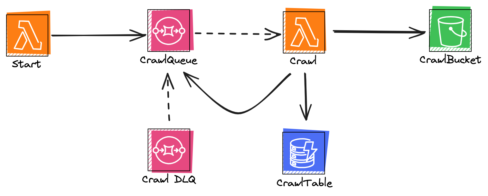

<!--
title: 'AWS Python Example'
description: 'This template demonstrates how to deploy a Python function running on AWS Lambda using the traditional Serverless Framework.'
layout: Doc
framework: v3
platform: AWS
language: python
priority: 2
authorLink: 'https://github.com/serverless'
authorName: 'Serverless, inc.'
authorAvatar: 'https://avatars1.githubusercontent.com/u/13742415?s=200&v=4'
-->


# Serverless Crawl - Serverless Framework AWS

This was generated using the Serverless Framework AWS Python template. 

This is an example of a serverless static website crawler using AWS Lambda, SQS, S3, and DynamoDB. 

**Note:** You may be notified by AWS about recursive  loops with Lambda. This is because of the Crawl SQS handler Lambda also writing to the same SQS queue that it is polling from. This is mitigated by using the DynamoDB table to track the URLs that have been queued.

## Plugins
- serverless-python-requirements
- serverless-lift

## Architecture


## Usage

### Deployment

In order to deploy the example, you need to run the following command:

```
$ serverless deploy
```

After running deploy, you should see output similar to:

```bash
Deploying aws-python-project to stage dev (us-east-1)

✔ Service deployed to stack aws-python-project-dev (112s)

functions:
  hello: aws-python-project-dev-start (1.5 kB)
```

### Invocation

After successful deployment, you can invoke the deployed function by using the following command:

```bash
serverless invoke --function start
```

### Local development

You can invoke your function locally by using the following command:

```bash
serverless invoke local --function start
```

### Bundling dependencies

In case you would like to include third-party dependencies, you will need to use a plugin called `serverless-python-requirements`. You can set it up by running the following command:

```bash
serverless plugin install -n serverless-python-requirements
```

Running the above will automatically add `serverless-python-requirements` to `plugins` section in your `serverless.yml` file and add it as a `devDependency` to `package.json` file. The `package.json` file will be automatically created if it doesn't exist beforehand. Now you will be able to add your dependencies to `requirements.txt` file (`Pipfile` and `pyproject.toml` is also supported but requires additional configuration) and they will be automatically injected to Lambda package during build process. For more details about the plugin's configuration, please refer to [official documentation](https://github.com/UnitedIncome/serverless-python-requirements).
